Nama: Indi Warda Ramadhani
<br>NIM: 2341760026
<br>Kelas: SIB 3D
<br>Mata Kuliah: Pemrograman Mobile

**APLIKASI OCR SEDERHANA  DENGAN  FLUTTER**

4.1.	Langkah 1: Buat Proyek Baru


4.2.	Langkah 2: Tambahkan Plugin

Buka file pubspec.yaml, lalu tambahkan dependensi berikut di bawah bagian dependencies:


Simpan file, lalu jalankan:


4.3.	Langkah 3: Tambahkan Izin Kamera (Android)

Buka file: android/app/src/main/AndroidManifest.xml
Tambahkan baris berikut di dalam tag <manifest>, sebelum <application>:


4.4.	Langkah 4: Buat Struktur Folder

Di dalam folder lib/, buat struktur berikut:


5.	KODE PROGRAM

5.1.	File: lib/main.dart


5.2.	File: lib/screens/splash screen.dart


5.3.	File: lib/screens/home screen.dart


5.4.	File: lib/screens/scan screen.dart


5.5.	File: lib/screens/result screen.dart


**TUGAS PRAKTIKUM**

1. Jalankan aplikasi di emulator atau HP.


2. Lakukan scan terhadap teks cetak (misal: buku, koran, atau layar HP).


3. Amati hasil OCR yang muncul.


4. Jawab pertanyaan berikut:

**a. Apakah semua teks terbaca dengan akurat? Mengapa?**

Tidak semua teks dapat dikenali dengan sempurna. Akurasi hasil OCR (Optical Character Recognition) dipengaruhi oleh berbagai faktor, seperti:

* Kualitas gambar yang kurang baik (terlalu buram, gelap, atau terlalu terang).
* Bentuk serta ukuran huruf yang sulit dibaca atau terlalu bergaya.
* Adanya gangguan visual seperti noise atau bayangan pada gambar.
* Posisi dan tata letak teks yang tidak sejajar, terpotong, atau saling menumpuk.

**b. Apa kegunaan fitur OCR dalam kehidupan sehari-hari?**

OCR berfungsi untuk mengubah teks dari gambar menjadi teks digital yang bisa disalin, diedit, maupun dicari. Dalam kehidupan sehari-hari, fitur ini bermanfaat untuk:

* Mempercepat proses input data dari dokumen cetak ke komputer.
* Membantu penyandang tunanetra membaca teks dengan bantuan teknologi pembaca suara.
* Memudahkan proses digitalisasi dokumen seperti arsip, nota, dan kuitansi agar lebih mudah disimpan serta ditemukan kembali.

**c. Sebutkan 2 contoh aplikasi nyata yang menggunakan OCR!**

* **Google Lens** – mengenali teks pada foto, papan nama, atau dokumen dan mengubahnya menjadi teks digital.
* **Adobe Scan** – memindai dokumen dan mengubah hasil foto menjadi file PDF dengan teks yang bisa disalin atau dicari.

**UJIAN TENGAH SEMESTER (UTS) PRAKTIKUM**

**Instruksi Awal (SETUP) - Wajib**

1. Pastikan proyek ocr_sederhana sudah diinisialisasi sebagai repositori Git dan ter hubung ke akun GitHub Anda.
2. Lakukan commit awal untuk memastikan branch main Anda bersih.

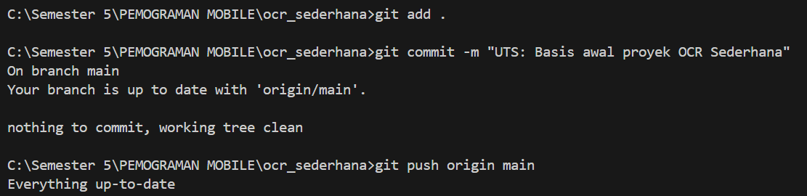

**Soal 1: Modifikasi Struktur Navigasi dan Aliran**
1. Pengubahan Navigasi Home

        • UbahElevatedButtondiHomeScreen(lib/screens/home_screen.dart) menjadi widget ListTile.

    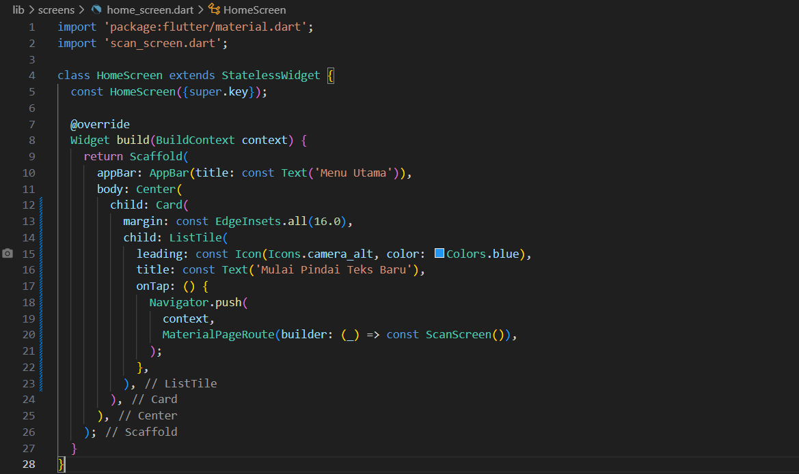

        • AturListTile: leading: Icon(Icons.camera_alt, color: Colors.blue);title: Text(’Mulai Pindai Teks Baru’).
   
    

        • Fungsi onTap harus menggunakan Navigator.push() untuk ke ScanScreen

    

2. Teks Utuh dan Navigasi Balik

        • DiResultScreen(lib/screens/result_screen.dart), hapus fungsi ocrText.replaceAll(’\n’,”) agar hasil teks ditampilkan dengan baris baru (\n) yang utuh.

    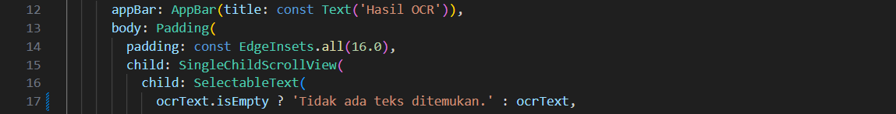

        • Tambahkan FloatingActionButton dengan ikon Icons.home.

    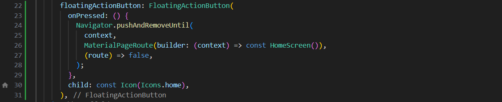

        • Ketika tombol ditekan, navigasi harus kembali langsung ke HomeScreen menggunakan Navigator.pushAndRemoveUntil() (atau metodeyang setara) untuk menghapus semua halaman di atasnya dari stack navigasi.

    

    **Perintah Commit Wajib (Soal 1)**

    Setelah Soal 1 selesai, lakukan commit dan push dengan pesan:
    ```dart
    git add lib/screens/home_screen.dart lib/screens/result_screen.dart
    git commit -m "UTS: Selesai Soal 1- ListTile dan Navigasi Balik"
    git push origin main
    ```
    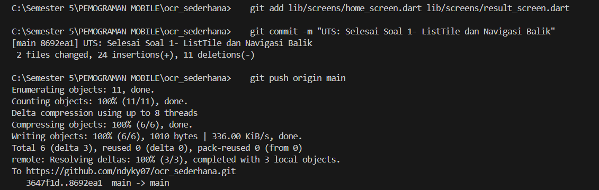
   
**Soal 2: Penyesuaian Tampilan dan Penanganan State/Error**

1. Custom Loading Screen di ScanScreen

        • DiScanScreen(lib/screens/scan_screen.dart), modifikasi tampilan loading yang muncul sebelum kamera siap (if (!controller.value.isInitialized)):

    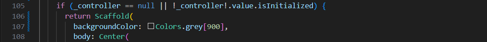

        • Latar Belakang: Scaffold(backgroundColor: Colors.grey[900]).

    

        • Isi: Di dalam Center, tampilkan Column berisi CircularProgressIndicator(color:Colors.yellow).

    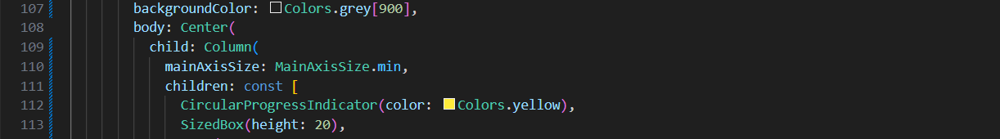

        • Di bawah indikator, tambahkan Text(’Memuat Kamera... Harap tunggu.’,style: TextStyle(color: Colors.white, fontSize: 18)).
   
    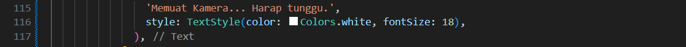

2. Spesifikasi Pesan Error

        • Di fungsi _takePicture() pada ScanScreen, modifikasi blok catch (e) untuk mengubah pesan error pada SnackBar.

    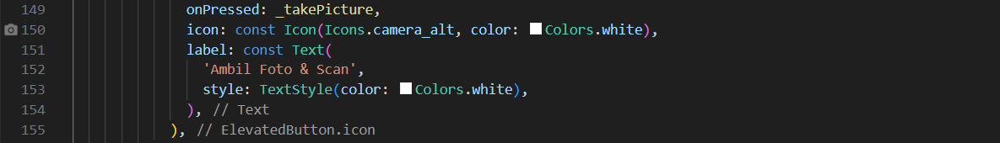

        • Pesan SnackBar harus berbunyi: "Pemindaian Gagal! Periksa Izin Kamera atau coba lagi." (Hilangkan variabel error ($e))

    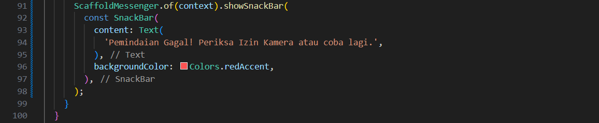

    **Perintah Commit Wajib (Soal 2)**

    Setelah Soal 2 selesai, lakukan commit dan push dengan pesan:
    ```dart
    git add lib/screens/scan_screen.dart
    git commit -m "UTS: Selesai Soal 2- Tampilan Loading dan Error"
    git push origin main
    ```
    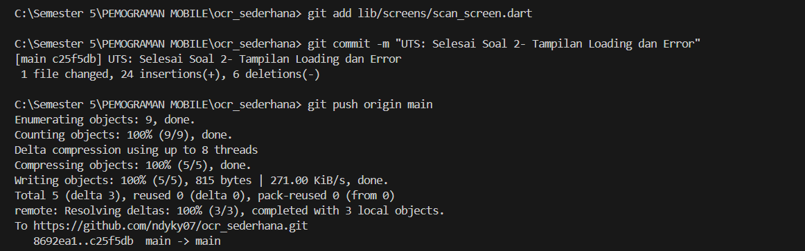

**Soal 3: Implementasi Plugin Text-to-Speech (TTS)**

1. Instalasi Plugin

        • Tambahkan plugin flutter_tts ke dalam file pubspec.yaml (gunakan versi terbaru yang kompatibel).

    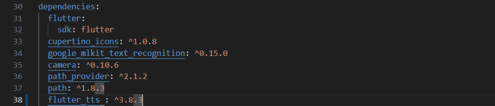

        • Jalankan flutter pub get

    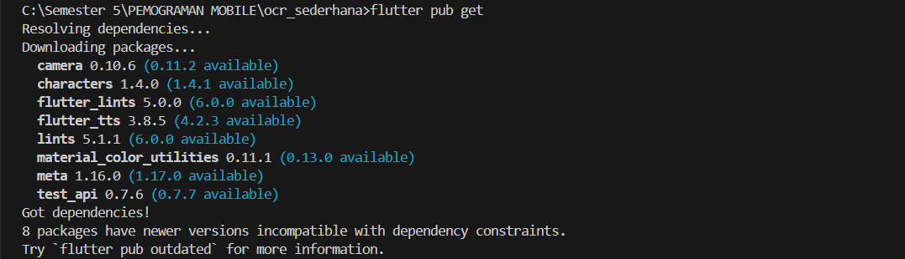

2. Konversi Widget dan Inisialisasi

        • Ubah ResultScreen dari StatelessWidget menjadi StatefulWidget.

    

        • Di initState(), inisialisasi FlutterTts dan atur bahasa pembacaan menjadi Bahasa Indonesia.

    

        • Implementasikan dispose() untuk menghentikan mesin TTS saat halaman ditutup.

    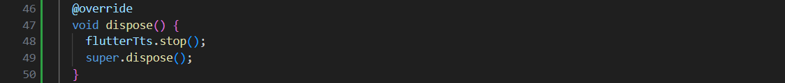

3. Fungsionalitas Pembacaan

        • TambahkanFloatingActionButtonkeduadiResultScreen (atau ganti AppBar dengan action button) dengan ikon Icons.volume_up.

    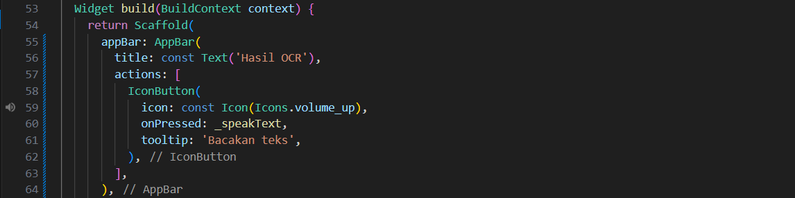

        • Ketika tombol ditekan, panggil fungsi speak() pada FlutterTts untuk membacakan seluruh isi ocrText.

    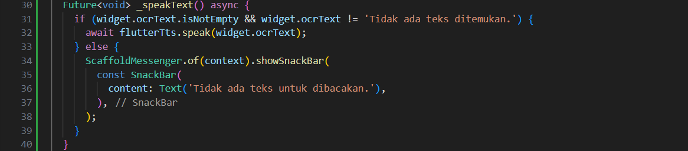

    **Perintah Commit Wajib (Soal 3)**

    Setelah Soal 3 selesai, lakukan commit dan push terakhir dengan pesan:
    ```dart
    git add pubspec.yaml lib/screens/result_screen.dart
    git commit -m "UTS: Selesai Soal 3- Implementasi Flutter TTS"
    git push origin main
    ```
    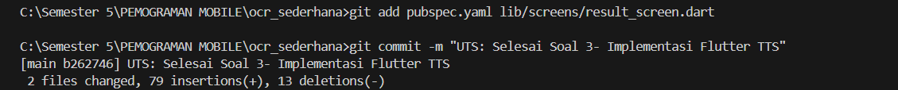

    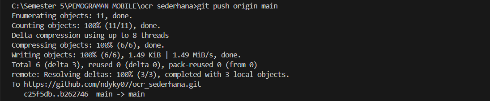

**Output**

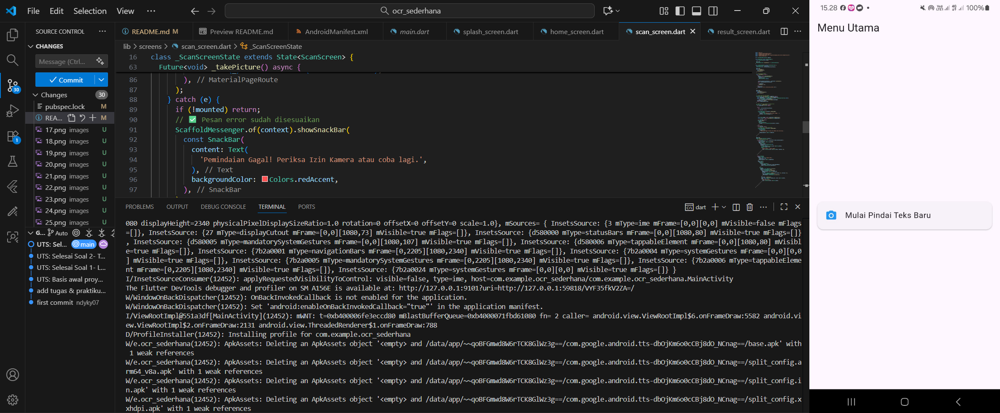

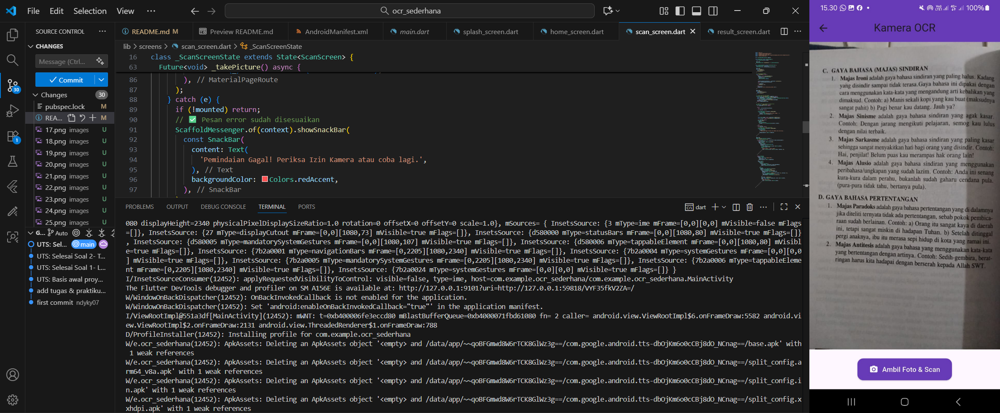

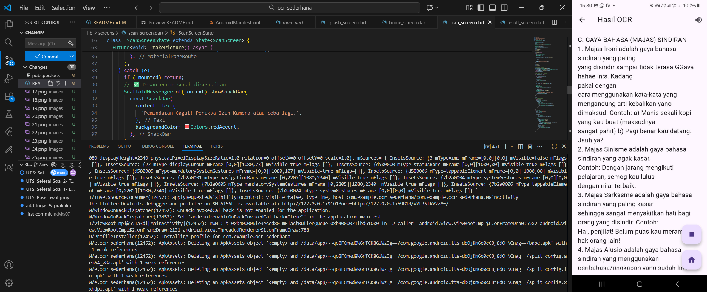
