Nama: Indi Warda Ramadhani
 NIM: 2341760026
 Kelas: SIB 3D
 Mata Kuliah: Pemrograman Mobile

**APLIKASI OCR SEDERHANA  DENGAN  FLUTTER**

4.1.	Langkah 1: Buat Proyek Baru

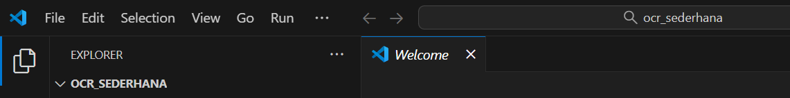

4.2.	Langkah 2: Tambahkan Plugin

Buka file pubspec.yaml, lalu tambahkan dependensi berikut di bawah bagian dependencies:

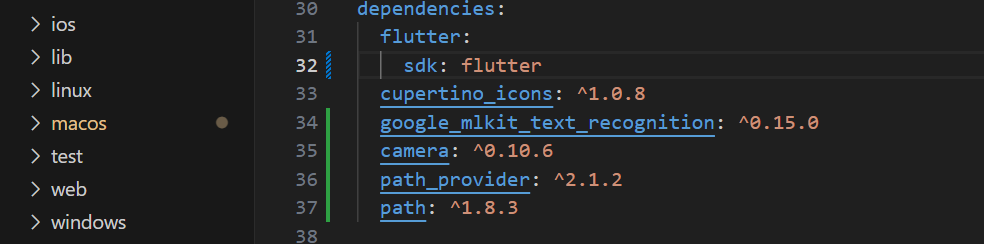

Simpan file, lalu jalankan:

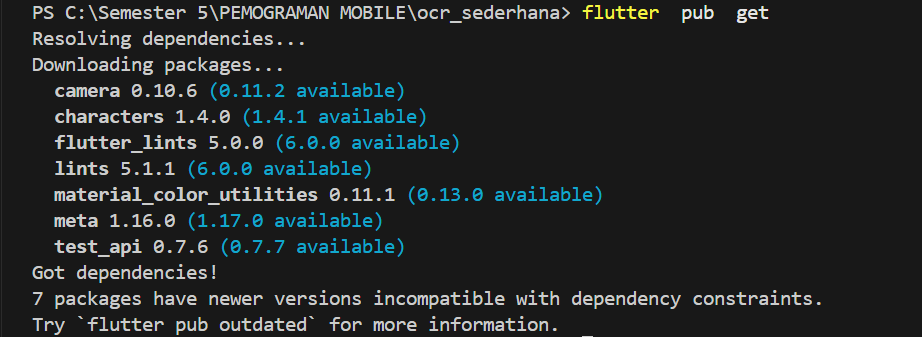

4.3.	Langkah 3: Tambahkan Izin Kamera (Android)

Buka file: android/app/src/main/AndroidManifest.xml
Tambahkan baris berikut di dalam tag <manifest>, sebelum <application>:

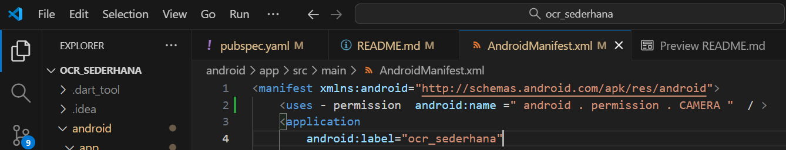

4.4.	Langkah 4: Buat Struktur Folder

Di dalam folder lib/, buat struktur berikut:

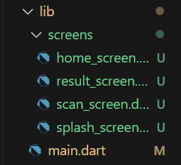

5.	KODE PROGRAM

5.1.	File: lib/main.dart

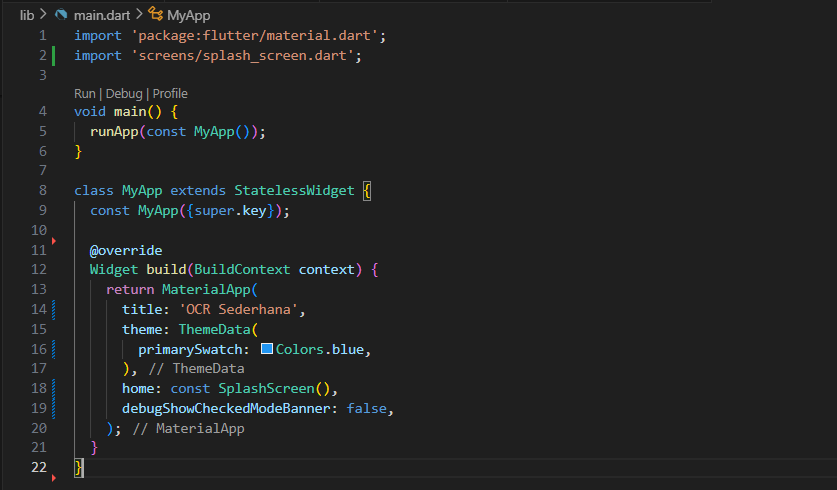

5.2.	File: lib/screens/splash screen.dart

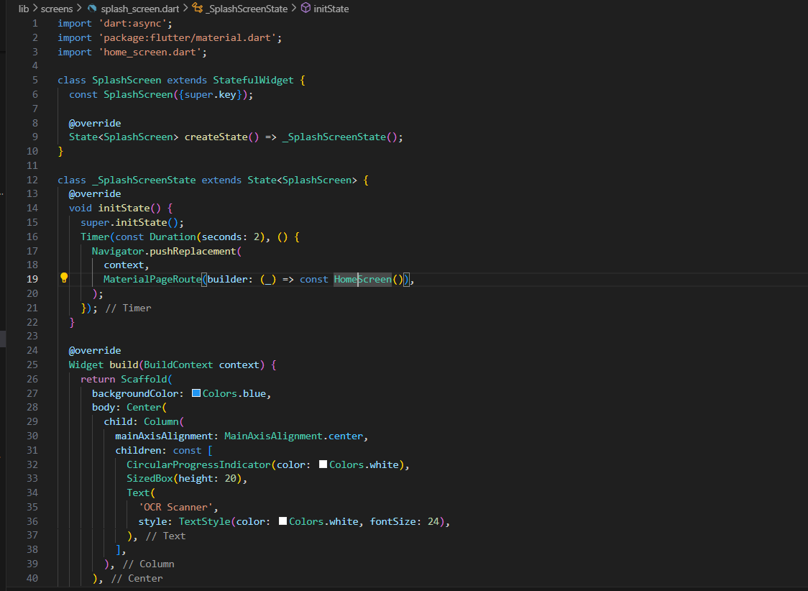

5.3.	File: lib/screens/home screen.dart

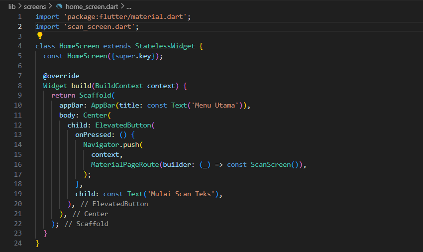

5.4.	File: lib/screens/scan screen.dart

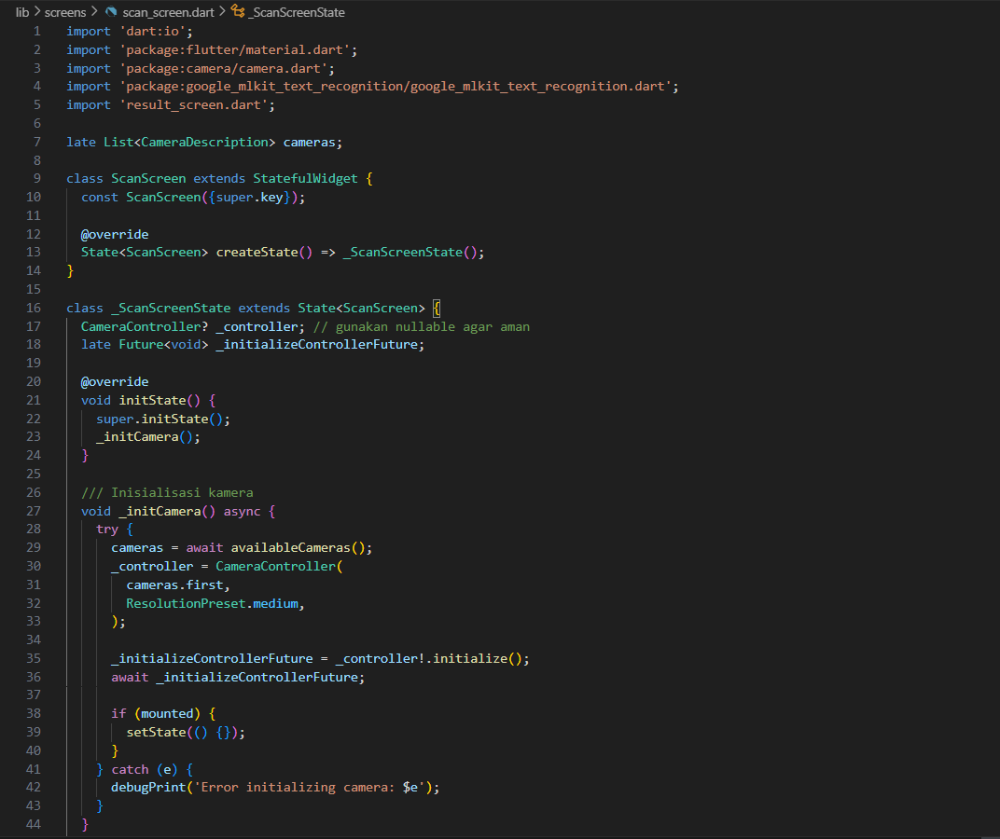

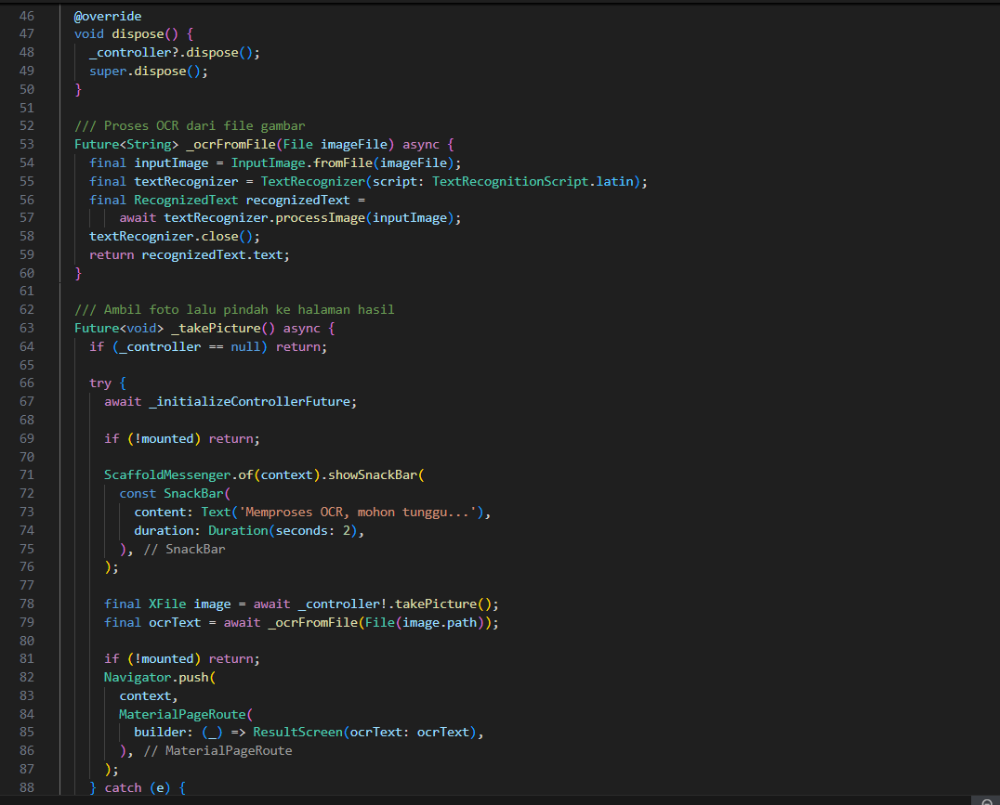

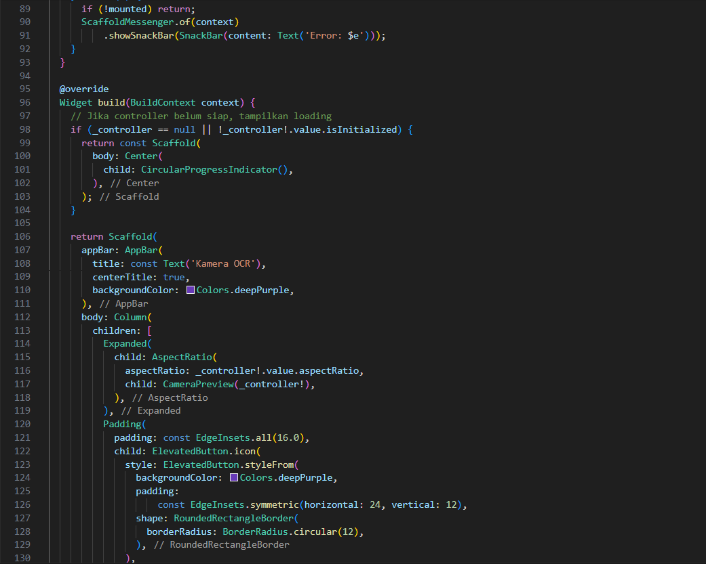

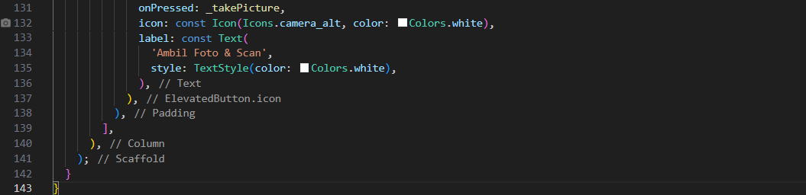

5.5.	File: lib/screens/result screen.dart

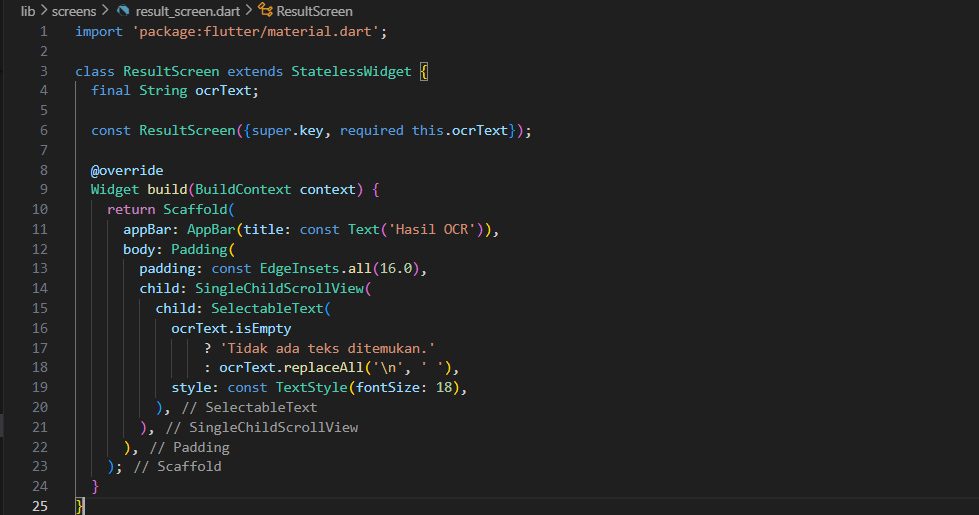

**TUGAS PRAKTIKUM**

1. Jalankan aplikasi di emulator atau HP.

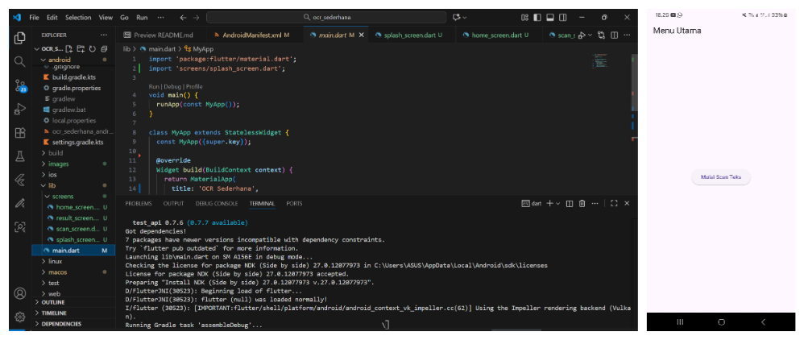

2. Lakukan scan terhadap teks cetak (misal: buku, koran, atau layar HP).

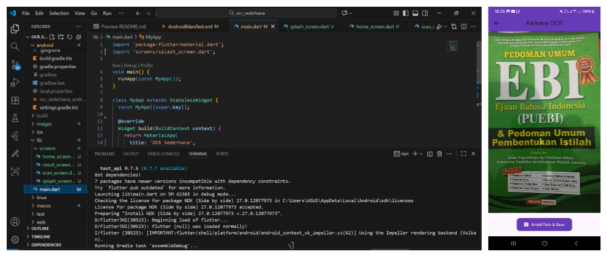

3. Amati hasil OCR yang muncul.

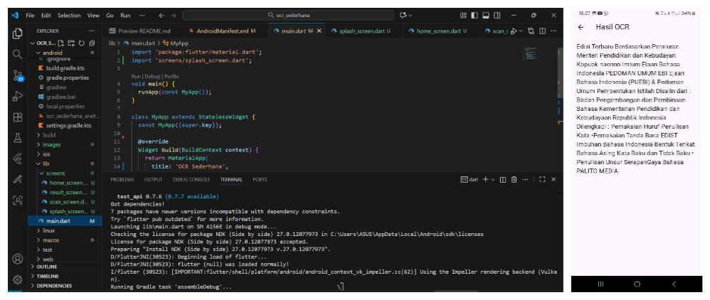

4. Jawab pertanyaan berikut:

**a. Apakah semua teks terbaca dengan akurat? Mengapa?**

Tidak semua teks dapat dikenali dengan sempurna. Akurasi hasil OCR (Optical Character Recognition) dipengaruhi oleh berbagai faktor, seperti:

* Kualitas gambar yang kurang baik (terlalu buram, gelap, atau terlalu terang).
* Bentuk serta ukuran huruf yang sulit dibaca atau terlalu bergaya.
* Adanya gangguan visual seperti noise atau bayangan pada gambar.
* Posisi dan tata letak teks yang tidak sejajar, terpotong, atau saling menumpuk.

**b. Apa kegunaan fitur OCR dalam kehidupan sehari-hari?**

OCR berfungsi untuk mengubah teks dari gambar menjadi teks digital yang bisa disalin, diedit, maupun dicari. Dalam kehidupan sehari-hari, fitur ini bermanfaat untuk:

* Mempercepat proses input data dari dokumen cetak ke komputer.
* Membantu penyandang tunanetra membaca teks dengan bantuan teknologi pembaca suara.
* Memudahkan proses digitalisasi dokumen seperti arsip, nota, dan kuitansi agar lebih mudah disimpan serta ditemukan kembali.

**c. Sebutkan 2 contoh aplikasi nyata yang menggunakan OCR!**

* **Google Lens** – mengenali teks pada foto, papan nama, atau dokumen dan mengubahnya menjadi teks digital.
* **Adobe Scan** – memindai dokumen dan mengubah hasil foto menjadi file PDF dengan teks yang bisa disalin atau dicari.

**UJIAN TENGAH SEMESTER (UTS) PRAKTIKUM**

**Instruksi Awal (SETUP) - Wajib**

1. Pastikan proyek ocr_sederhana sudah diinisialisasi sebagai repositori Git dan ter hubung ke akun GitHub Anda.
2. Lakukan commit awal untuk memastikan branch main Anda bersih.

